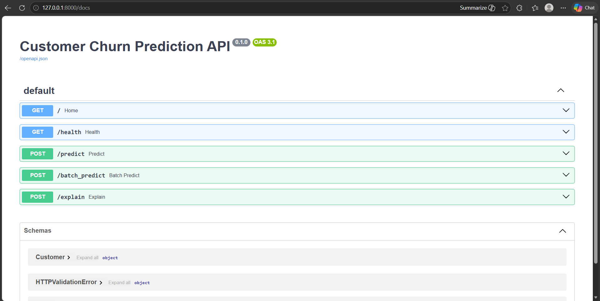
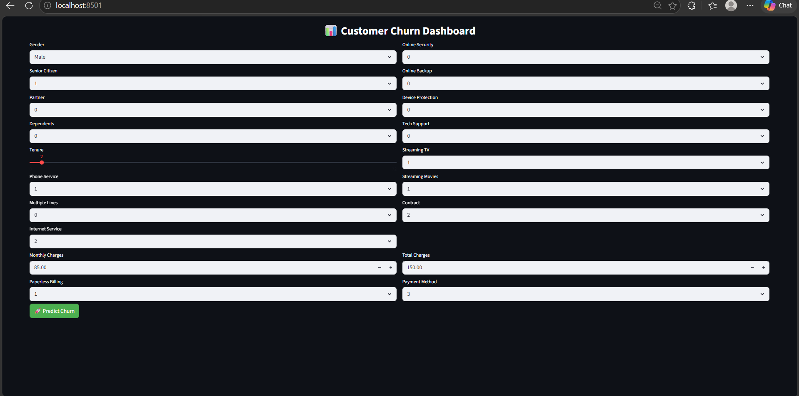
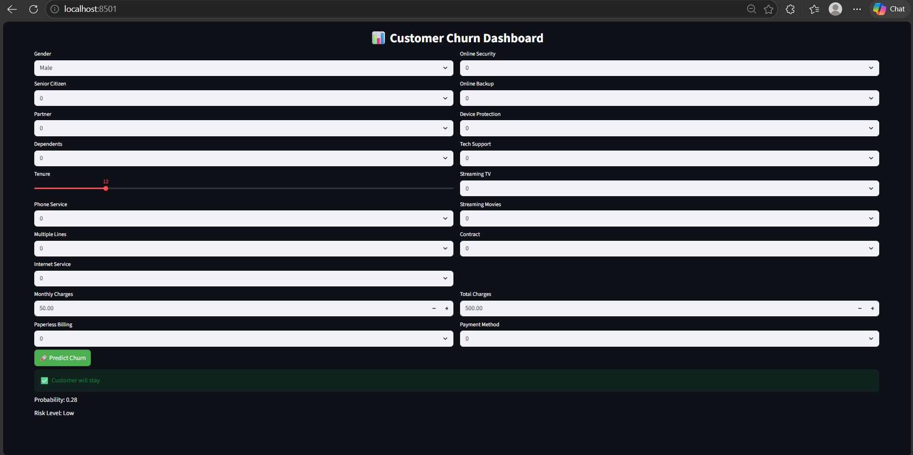
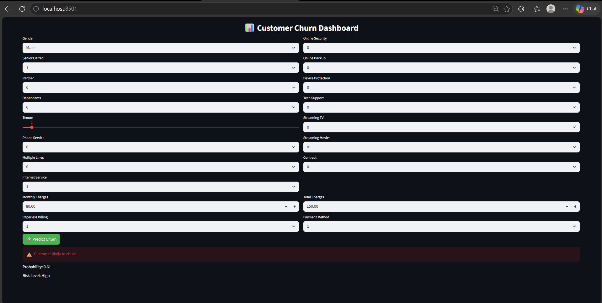

# 📊 Customer Churn Prediction System

An end-to-end Machine Learning project that predicts whether a telecom customer is likely to churn. The system includes a trained ML model, FastAPI backend, and an interactive Streamlit dashboard.

---

## 🚀 Project Overview

Customer churn is a major problem for telecom companies. Retaining existing customers is more cost-effective than acquiring new ones.

This project helps:

* Predict customer churn probability
* Classify customers into risk levels (Low / Medium / High)
* Provide an interactive dashboard for real-time predictions

---

## 🧠 Tech Stack

* Python
* Pandas, NumPy
* Scikit-learn
* FastAPI
* Uvicorn
* Streamlit

---
## 📁 Project Structure

```
Customer-Churn-Prediction/
│
├── data/
│   └── telco_churn.csv
│
├── models/
│   └── churn_model.pkl
│
├── outputs/
│   ├── confusion_matrix.png
│   └── feature_importance.csv
│
├── images/
│   ├── api.png
│   ├── dashboard.png
│   ├── positive.png
│   └── negative.png
│
├── src/
│   ├── api.py
│   ├── preprocess.py
│   └── train.py
│
├── app.py
├── requirements.txt
└── README.md
```
---

## 📊 Dataset Information

Dataset: Telco Customer Churn Dataset

Features include:

* Gender
* Senior Citizen
* Tenure
* Monthly Charges
* Contract Type
* Payment Method
* Internet Services

Target:

* Churn (0 = No, 1 = Yes)

---

## ⚙️ Model Details

* Classification model used
* Data preprocessing:

  * Missing value handling
  * Encoding categorical features

Outputs:

* Churn prediction
* Probability score
* Risk level

---

## 📈 Model Performance

Accuracy  : ~80%
Precision : ~78%
Recall    : ~75%
F1 Score  : ~76%

---

## ⚠️ Risk Level Logic

| Probability | Risk   |
| ----------- | ------ |
| < 0.4       | Low    |
| 0.4 - 0.7   | Medium |
| > 0.7       | High   |

---

## 🔄 How It Works

1. User enters data in Streamlit UI
2. Data is sent to FastAPI backend
3. Preprocessing is applied
4. Model predicts churn
5. Output shows:

   * Prediction
   * Probability
   * Risk level

---

## ▶️ Run the Project

Clone repository:
git clone https://github.com/Swetha07062003/Customer-Churn-Prediction.git
cd Customer-Churn-Prediction

Install dependencies:
pip install -r requirements.txt

Start FastAPI:
uvicorn src.api:app --reload

Run dashboard:
streamlit run app.py

---

## 📸 Screenshots

API Interface


Dashboard UI


Customer Will Stay


Customer Will Churn


---

## 🎯 Use Case

* Identify customers likely to churn
* Improve retention strategies
* Reduce revenue loss

---

## 🚀 Future Improvements

* Deploy on cloud
* Add explainability (SHAP)
* Use advanced ML models

---

## 👩‍💻 Author

Swetha K
---

